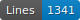
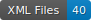

# FONDUE-LA-MSS-MA

   

This repo contains the transcription of medieval latin manuscripts.

## Content

| Town  | Library | Shelfmark  | Folios        | Date            | Hand                                | Transcription |
|-------|---------|------------|---------------|-----------------|-------------------------------------|---------------|
| Paris | BnF     | Latin 7558 | ff. 104v-124r | 1st half 9th c. | minuscule caroline à longues lignes | A. Leflaëc    |

## How to cite

Cf. [CITATION.cff](https://github.com/FoNDUE-HTR/FONDUE-FR-MSS-MA/blob/master/CITATION.cff)

## Licences
Annotation is CC-BY. Images belong to Gallica

 